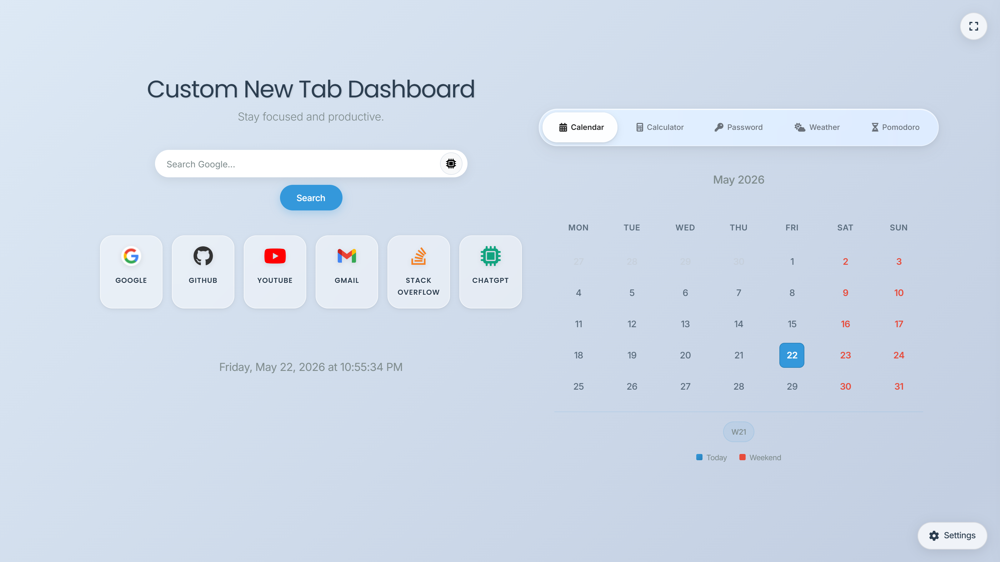
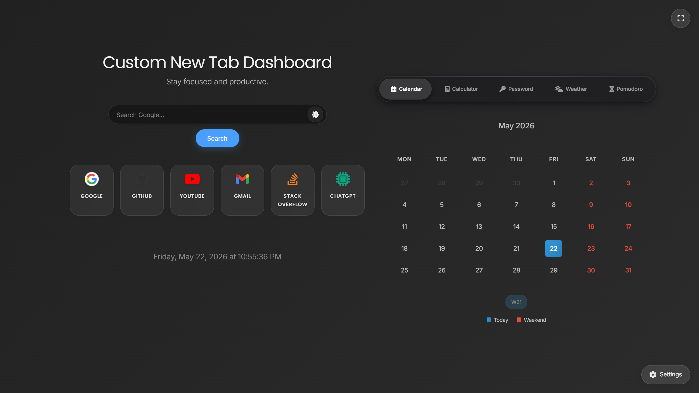
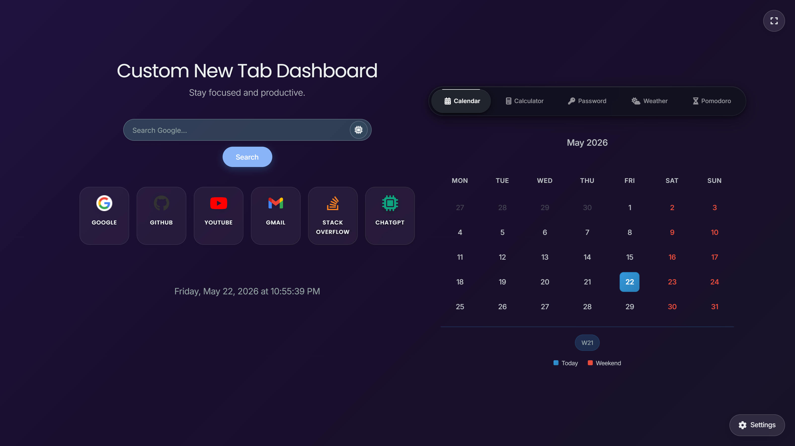
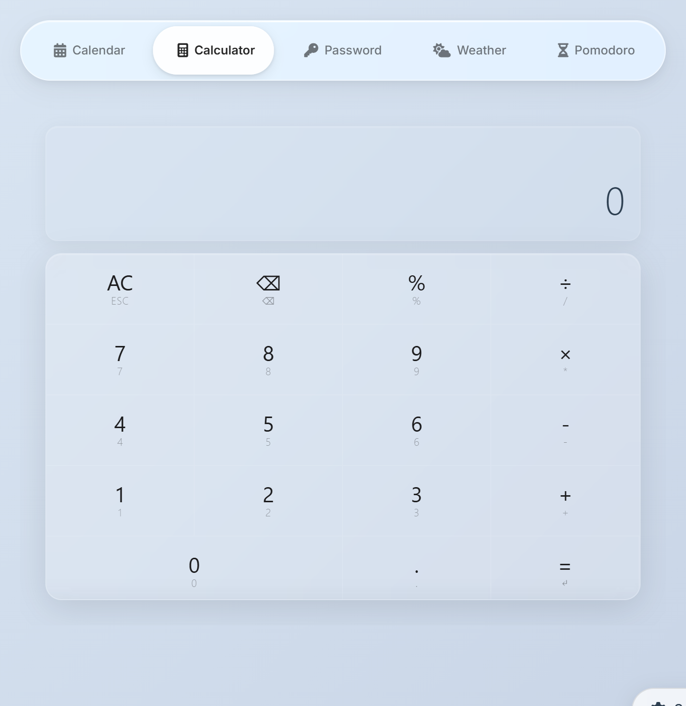
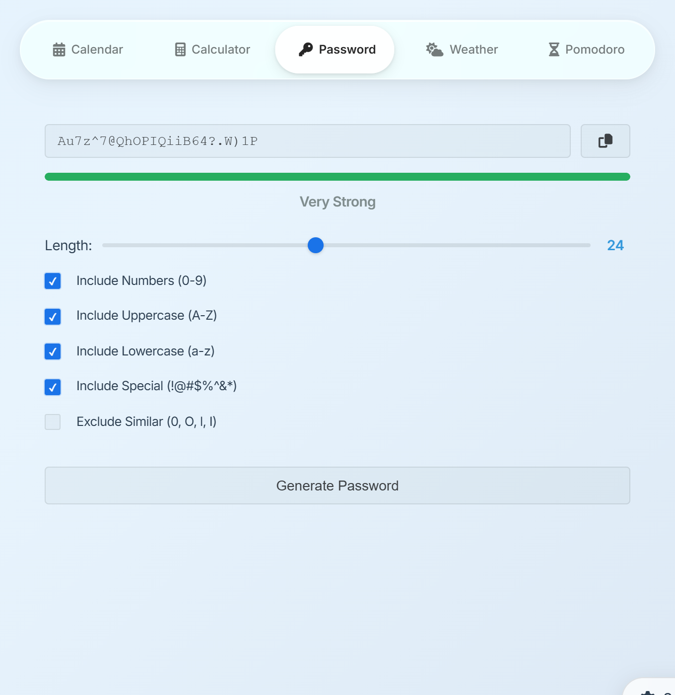
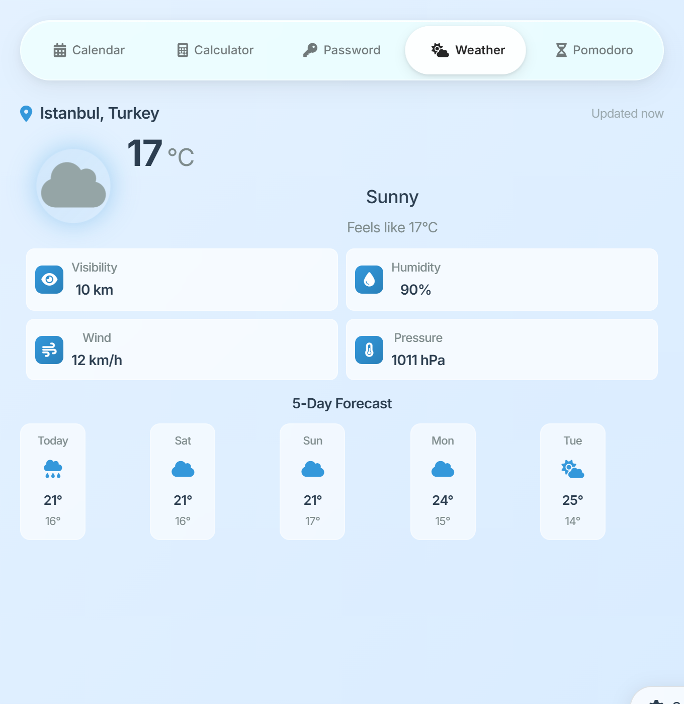
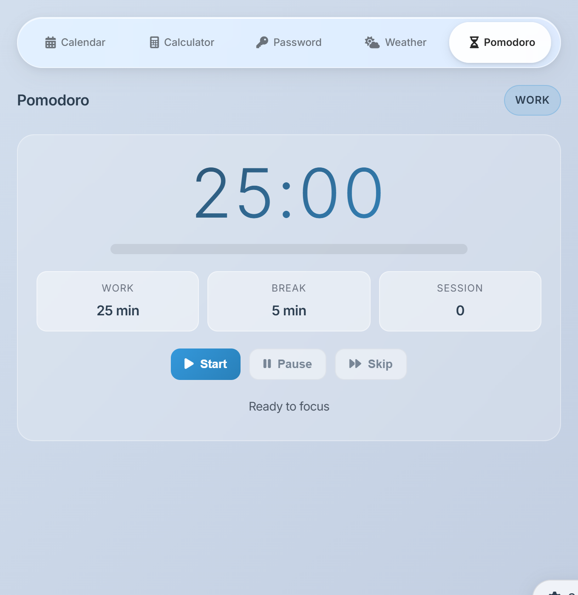
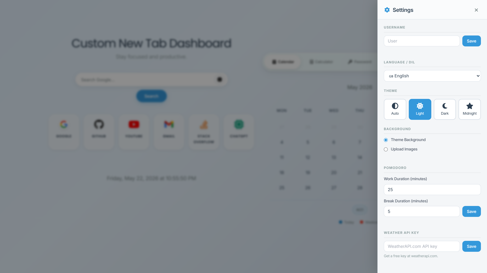
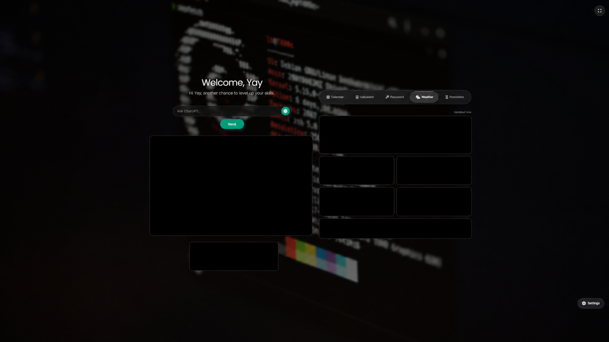
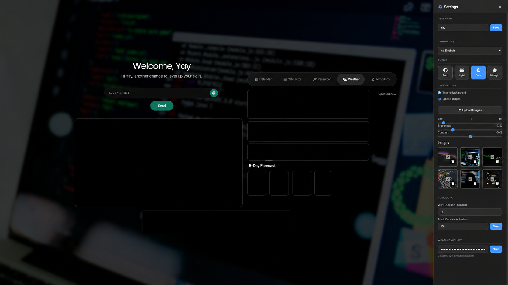

# Browser Startup

A clean, customizable browser **new tab** dashboard built with vanilla **HTML, CSS, and JavaScript** — featuring quick-launch shortcuts, productivity widgets, multiple themes, and fully local settings. No build step, no backend, no tracking.



<p align="center">
  
  
  
  
  
</p>

## Table of Contents

- [Features](#features)
- [Screenshots](#screenshots)
- [Installation](#installation)
- [Usage](#usage)
- [Configuration](#configuration)
- [Project Structure](#project-structure)
- [Tech Stack](#tech-stack)
- [Privacy](#privacy)
- [Security Notes](#security-notes)
- [License](#license)

## Features

- **Quick-launch shortcuts** — an editable grid of links with Font Awesome or custom image icons, preset brand colors, and a custom color picker. Right-click any shortcut to edit or delete it, and add new ones from the settings panel.
- **Smart search** — search the web from the dashboard, or toggle **ChatGPT mode** to send your query straight to ChatGPT.
- **Productivity widgets** in a single switchable panel:
  - **Calendar** — monthly view with week numbers and today / weekend highlighting.
  - **Calculator** — full keyboard support (numbers, operators, `Esc`, `Backspace`, `Enter`).
  - **Password Generator** — cryptographically secure passwords (4–50 chars) with character-set toggles, a live strength meter, and one-click copy.
  - **Weather** — automatic IP-based location with current conditions and a 5-day forecast. Works out of the box with public weather data, and supports your own WeatherAPI.com key.
  - **Pomodoro Timer** — configurable work / break durations, session counter, and start / pause / skip controls.
- **Four themes** — `Auto` (switches by local sunrise/sunset), `Light`, `Dark`, and `Midnight`.
- **Custom backgrounds** — use the theme gradient or upload your own images with adjustable blur, brightness, contrast, and automatic rotation.
- **Bilingual UI** — full **English** and **Turkish** translations.
- **Personalized greeting** — set a username for a time-aware welcome message.
- **Backup & restore** — export and import your settings as a `.yay` file, or reset everything to defaults.
- **Fullscreen mode** and a fully **local-first** design — everything is stored in your browser.

## Screenshots

### Themes

<table>
  <tr>
    <td align="center" width="50%"><br><b>Dark</b></td>
    <td align="center" width="50%"><br><b>Midnight</b></td>
  </tr>
</table>

### Widgets

<table>
  <tr>
    <td align="center" width="50%"><br><b>Calculator</b></td>
    <td align="center" width="50%"><br><b>Password Generator</b></td>
  </tr>
  <tr>
    <td align="center" width="50%"><br><b>Weather</b></td>
    <td align="center" width="50%"><br><b>Pomodoro Timer</b></td>
  </tr>
</table>

### Settings



### Make It Your Own

Upload your own background, expand the shortcut grid, switch to ChatGPT search, and set a personal greeting — here's the dashboard in everyday use:

<table>
  <tr>
    <td align="center" width="50%"><br><b>Personalized dashboard</b></td>
    <td align="center" width="50%"><br><b>Upload &amp; manage backgrounds</b></td>
  </tr>
</table>

## Installation

This is a Chrome **Manifest V3** extension that overrides the new tab page.

1. Clone or download this repository.
   ```bash
   git clone https://github.com/ByYay/BrowserStartup.git
   ```
2. Open Chrome and go to `chrome://extensions/`.
3. Enable **Developer mode** (top-right toggle).
4. Click **Load unpacked**.
5. Select the project folder.
6. Open a new tab to see your dashboard.

> Works in any Chromium-based browser that supports Manifest V3 (Chrome, Edge, Brave, etc.).

## Usage

- **Open a new tab** to use the dashboard.
- **Search** with the search bar, or click the chip icon to toggle **ChatGPT mode**.
- **Switch widgets** using the tabs at the top of the widget panel.
- **Manage shortcuts** — right-click a shortcut to **Edit** or **Delete** it; add new ones from **Settings → Shortcuts**.
- **Open Settings** with the gear button in the bottom-right corner.
- **Back up** your dashboard by exporting a `.yay` file from **Settings → Data Management**, and restore it later by importing.

## Configuration

All options live in the **Settings** panel:

| Setting | Description |
| --- | --- |
| **Username** | Personalizes the greeting shown in the header. |
| **Language / Dil** | Switch the entire UI between English and Turkish. |
| **Theme** | Choose `Auto`, `Light`, `Dark`, or `Midnight`. |
| **Background** | Use the theme gradient or upload images with blur / brightness / contrast and rotation controls. |
| **Pomodoro** | Set custom work and break durations. |
| **Weather API Key** | Optional [WeatherAPI.com](https://www.weatherapi.com/) key for your own weather data (stored locally, never exported). |
| **Shortcuts** | Add new shortcuts (edit / delete via right-click on the grid). |
| **Data Management** | Export / import a `.yay` backup, or reset to defaults. |

## Project Structure

```text
custom-new-tab-dashboard/
├── css/                # Styles, split per feature (base, widgets, themes, responsive, …)
├── js/                 # Vanilla JS modules
│   ├── app.js          # App bootstrap / init
│   ├── shortcuts.js    # Shortcut grid + context menu
│   ├── search.js       # Search + ChatGPT mode
│   ├── calendar.js     # Calendar widget + date/time
│   ├── calculator.js   # Calculator widget
│   ├── password.js     # Password generator
│   ├── weather.js      # Weather widget + geolocation
│   ├── clock.js        # Pomodoro timer
│   ├── widgets.js      # Widget panel switching
│   ├── themes.js       # Theme + auto (sunrise/sunset) logic
│   ├── background.js   # Background images / filters
│   ├── settings.js     # Settings panel + export/import
│   └── translations.js # EN / TR strings
├── screenshots/        # Images used in this README
├── index.html          # Dashboard markup
├── manifest.json       # Chrome extension manifest (MV3)
├── README.md
├── LICENSE
└── .gitignore
```

## Tech Stack

- **Vanilla HTML, CSS, JavaScript** — no frameworks, no build step, zero npm dependencies.
- **Chrome Extensions Manifest V3** (`chrome_url_overrides.newtab`).
- **Font Awesome** & **Google Fonts** (loaded via CDN).
- **Web Crypto API** for secure password generation.
- Public weather & IP-geolocation services, with **WeatherAPI.com** / **OpenWeatherMap** support.

## Privacy

- No backend server is used.
- No analytics or tracking is included.
- Settings are stored locally in the browser.
- The weather API key is stored locally and is **not** included in exported backups.
- Uploaded background images and preferences stay in local browser storage.
- Weather features may call third-party weather or location services when enabled.

## Security Notes

- Password generation uses the Web Crypto API via `crypto.getRandomValues()`.
- Weather API keys are entered by the user and are never bundled with the project.
- Some assets load from external CDNs; for a fully offline package, they can be bundled locally.

## License

This project is licensed under the **MIT License** — see [`LICENSE`](LICENSE) for details.

Copyright (c) 2026 ByYay
